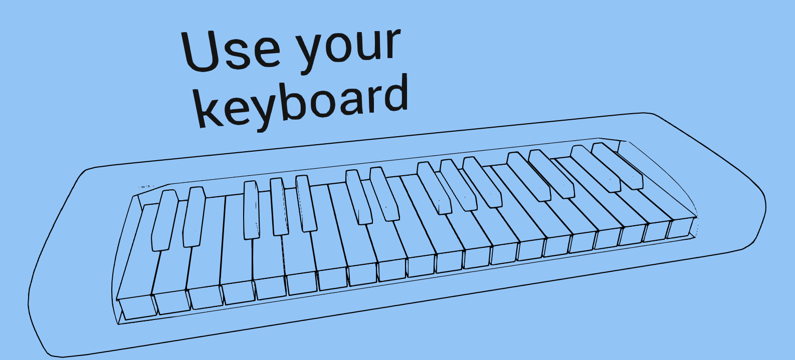
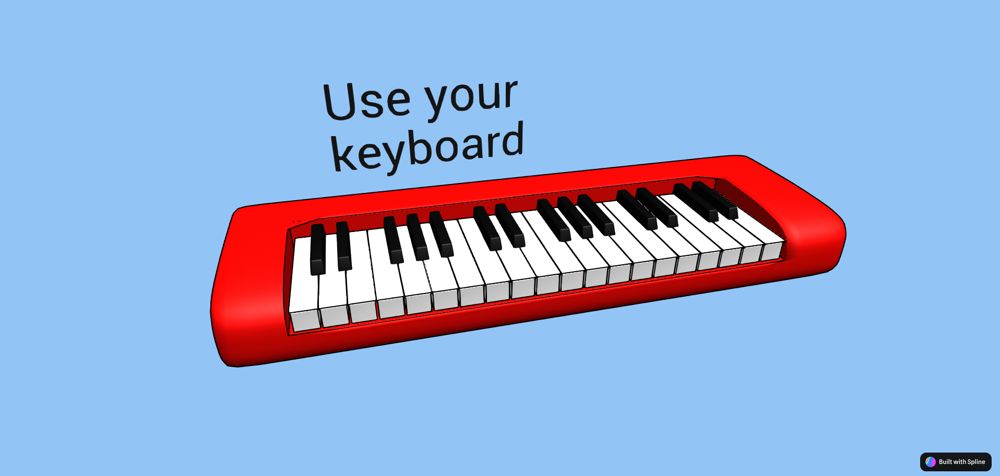
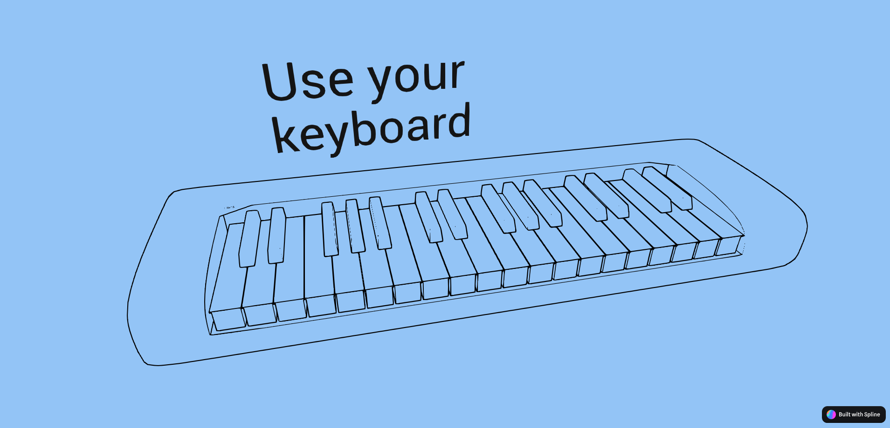

# Spline Piano

A working online Piano build with [Spline 💖](https://spline.design/)

### Wireframe Version

Demo: [my.spline.design/pianowireframe-a2c8a80bad29728285279b29e801105b](https://my.spline.design/pianowireframe-a2c8a80bad29728285279b29e801105b/)

⚠️ Use your keyboard z-/ and q-p for the white keys and the rows above are the black keys

Mouse clicks are not supported as of now

### Colored Version

Demo: [my.spline.design/pianobasecopy-722c624168ea27a9547efc521052a3b0](https://my.spline.design/pianobasecopy-722c624168ea27a9547efc521052a3b0/)

⚠️ Use your keyboard z-/ and q-p for the white keys and the rows above are the black keys
Mouse clicks are not supported as of now

## Screenshots

## License

 

